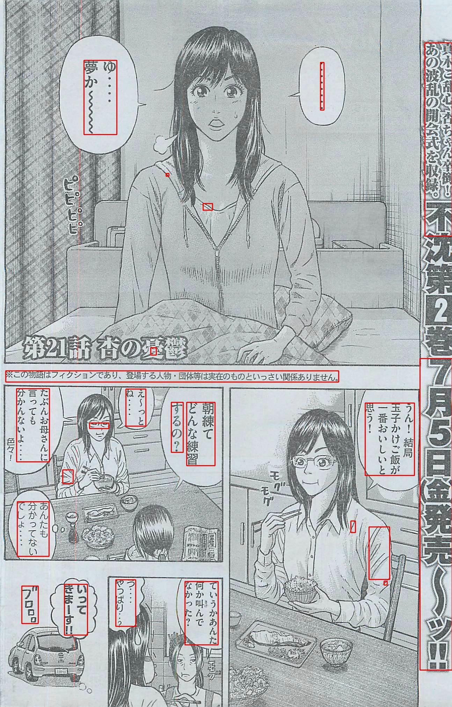
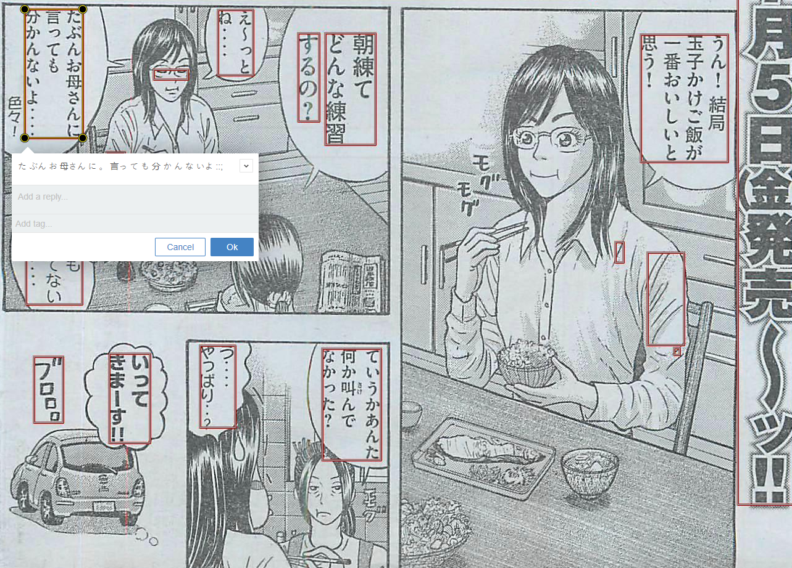
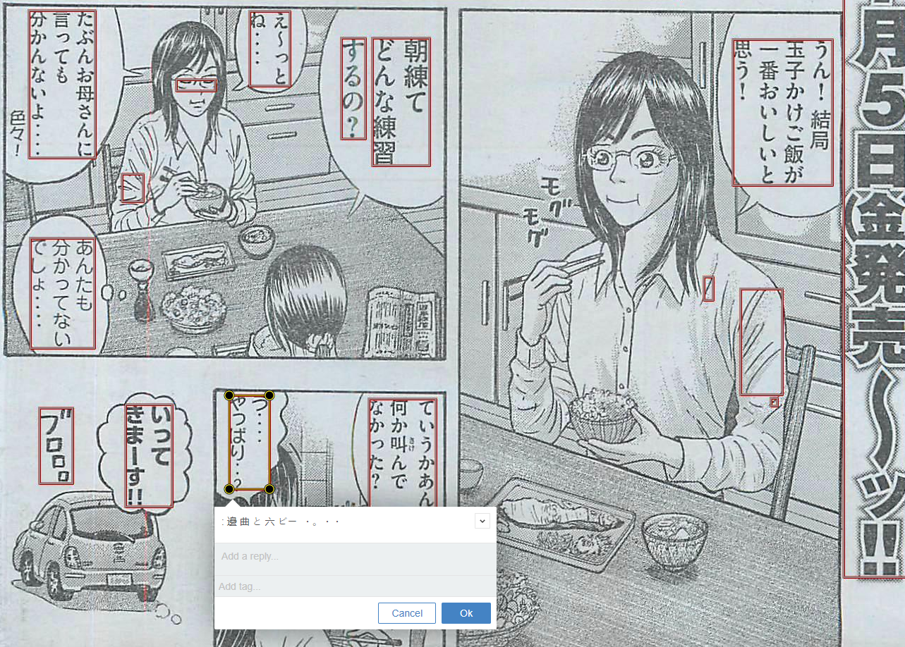

MangaTextDetection
==================

Experiments in text localization and detection in raw manga scans. Mostly using OpenCV python API.


Overview
--------
This repository holds some experiments I did in summer 2013 during a sudden interest in text detection in images. It uses some standard techniques (run length smoothing, connected component analysis) and some experimental stuff. Overall, I was able to get in the neighborhood of where I wanted to be, but the results are very processing intensive and not terribly reliable.

Usage
-----
Provide an input file or path using the arguments `-i` and `-p`, respectively. When an input path is provided, all files in the directory are processed. The user may provide a corresponding output file or path using the `-o` argument. The output is saved in the default file/directory if no output argument is defined.
```
    python MangaOCR_dev.py -i <infile> -o <outfile>
    python MangaOCR_dev.py -p <inpath> -o <outpath>
    python MangaOCR_dev.py -p <inpath> --default_directory
```
Other useful arguments:
```
    --html : Display output in an html file.
    --default-directory : Store output in predefined folders. This is recommended for processing images in a directory since the input may be overwritten.
    --additional_filtering : Attempt to filter false text positives by histogram processing.
```

State
-----
I haven't bothered to form this into a python library. It's just a series of scripts each trying out various things, such as:
* Isolating bounding boxes for text areas on a raw manga page.
* Identifying ares of furigana text (pronunciation guide, which can screw up OCR) in text bounding boxes.
* Preparing identified text areas for basic OCR.


Text Location Example
---------------------
Here's an example run of a page from Weekly Young Magazine #31 2013. The input image is as follows (jpg).


An initial estimate of text locations can be found by the `MangaOCR.py` script:

```
    python MangaOCR.py -i 194.jpg
```

With the results as follows (estimated text marked with red boxes):



Note that in the output above you see several of the implementation deficiencies. For example, there are several small false positives scattered around, and some major false positives on the girl's sleeve and eyes in panels 2 and 3.
Also note that many large areas of text were not detected (false negatives). Despite how pleased I was with the results (and I was more pleased than you could possibly believe) significant improvements are needed.

Text Segmentation Example
-------------------------
To more easily separate text from background you can also segment the image, with text areas and non text being separated into different (RGB) color channels. This easily allows you to remove estimated text from image entirely or vice-versa.
Use the command:
```
    python segmentation.py 194.jpg -o 194_segmentation.png
```
The results follow:


OCR and Html Generation
-----------------------
I did take the time to run simple OCR on some of the located text regions. This uses the python wrapper for Google's OCR engine Tesseract (pytesserract). Unlike the original version of the `ocr.py` script, text is assumed to be vertically aligned.

I also embedded those results in an HTML output, allowing "readers" to hover on Japanese Text, revealing the OCR output, which can be edited/copied/pasted. This is by using the optional argument `--html`. Some examples can be seen below:




Even after using `jpn_vert` trained data, results are still unreliable. Most of the bounding boxes with larger width return successful results. Error mostly happens when the bounding box only has one line of vertically-aligned text.

Dependencies
-----------------------
You should be able to install most of the dependencies via pip, or you could use your operating systems package manager (e.g. Mac OS X http://brew.sh/)

### Python 3+

https://www.python.org/

Install as per OS instructions.

### Numpy

http://www.numpy.org/

```
pip install numpy
```

### Scipy

http://www.scipy.org/index.html

```
pip install scipy
```

### Matplotlib (contains PyLab)

http://matplotlib.org/

```
pip install matplotlib
```

### Pillow

http://pillow.readthedocs.org/en/latest/

```
pip install Pillow
```

### OpenCV

http://opencv.org/

```
Install as per OS instructions, this should also include the python bindings.
```

### Tesseract

https://code.google.com/p/tesseract-ocr/

Install as per OS instructions, then use pip to install the python bindings.
Don't forget to include your target language's trained data sets and set the `tesseract_cmd` PATH. (See `ocr.py` script)

```
Edit line 7 of ocr.py script:
pytesseract.pytesseract.tesseract_cmd = <path>
```
